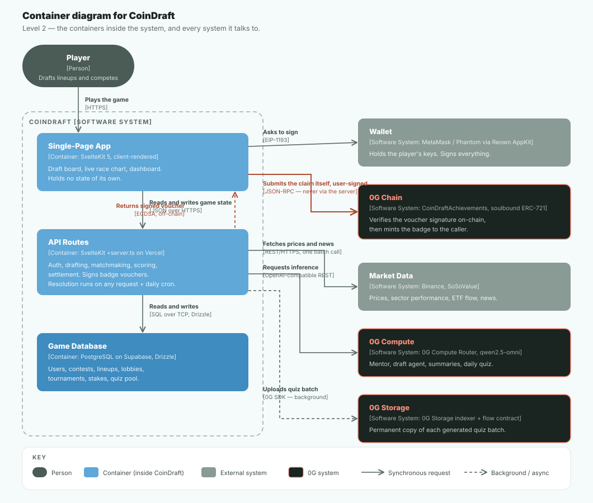

# CoinDraft — Product Requirements Document

### Version 1.0 · SoSoValue Buildathon

> For the current technical architecture and 0G integration detail, see [ARCHITECTURE.md](ARCHITECTURE.md).

---

## 1. Executive summary

CoinDraft is a gamified crypto intelligence platform that combines fantasy sports mechanics with real-time market research. Users draft token lineups across crypto sectors, compete head-to-head, and receive AI-powered post-match breakdowns powered by SoSoValue's data infrastructure. The platform teaches crypto market literacy through gameplay — research becomes strategy, strategy becomes sport.

**One-sentence pitch:** Fantasy sports meets crypto research — draft token lineups, compete head-to-head, and get smarter with every match through AI-powered market insights.

---

## 2. Problem statement

### The crypto education problem

Most retail crypto users fall into one of three traps:

- They hold tokens based on social media hype with no research framework
- They want to learn but find research tools intimidating and joyless
- They do research but have no competitive or social outlet to apply it

### The engagement problem

Crypto dashboards, news aggregators, and analytics tools have a fundamental UX problem: they are built for people who already know what they're doing. There is no feedback loop, no reward mechanism, and no reason to come back daily.

### The opportunity

Fantasy sports solved this exact problem for traditional finance — turning passive spectating into active, engaged participation. Nobody has successfully applied this model to crypto with real data infrastructure behind it. CoinDraft fills that gap.

---

## 3. Solution

A three-layer platform:

**Intelligence layer** — Sector Wars (live sector performance) and Whale Watch (ETF institutional flow alerts) give users market context before they draft. Powered by SoSoValue API.

**Learn layer** — The Gauntlet (daily market challenges based on real data) and an AI Mentor teach market literacy through doing, not reading. Completing challenges earns draft boosts.

**Play layer** — Fantasy-style draft contests. Pick 5 tokens across L1, L2, Meme, DeFi, and Wildcard slots. Compete head-to-head. Score on real price performance. Get an AI breakdown after every match explaining why each token moved using SoSoValue research feeds.

The key mechanic: **knowledge earned in the learn layer gives a visible edge in the play layer.** Research is not optional decoration — it is the cheat code.

---

## 4. Target users

### Primary — Casual crypto curious

People who follow crypto on social media, hold a few tokens, but have no research framework. Fantasy sports is a format they already understand. CoinDraft gives them a way into crypto that feels familiar and fun.

- **Pain point:** Too much noise, no clear way to learn, research feels like homework
- **Job to be done:** Feel smart and competitive about crypto without being overwhelmed
- **Acquisition:** Crypto Twitter, fantasy sports crossover communities, TikTok/YouTube finance

### Secondary — Active retail trader

Someone who tracks sectors, reads news, and has market opinions. They want a competitive outlet to prove their edge and a social layer around their research.

- **Pain point:** Doing the research alone with no reward for being right
- **Job to be done:** Validate their thesis, compete, and build a track record
- **Acquisition:** Crypto Reddit, CT (Crypto Twitter), Discord trading communities

### Tertiary — Complete beginner

Someone who wants to get into crypto but finds it overwhelming. The Gauntlet and AI Mentor give them a structured, low-stakes entry point.

- **Pain point:** Every platform assumes prior knowledge
- **Job to be done:** Learn by doing, with real market feedback and no financial risk upfront
- **Acquisition:** Web3 onboarding communities, university groups, fintech apps

---

## 5. Market fit

### Why now

- Bitcoin spot ETFs launched in January 2024 — institutional crypto is now mainstream news
- Fantasy sports market is $11B+ globally and growing — the format is proven at scale
- Crypto retail participation is at all-time highs but education infrastructure lags far behind
- SoSoValue's API provides the data infrastructure that makes real-time gamification possible
- SoDEX launched March 2026 — a fresh ecosystem to build on with early-mover advantage

### Competitive landscape

| Product             | Category          | Gap CoinDraft fills                  |
| ------------------- | ----------------- | ------------------------------------ |
| Polymarket          | Prediction market | Binary yes/no only, no learning loop |
| Metaculus           | Forecasting       | No crypto focus, no fantasy mechanic |
| CoinMarketCap       | Data dashboard    | Passive — no engagement or gameplay  |
| Zapper              | Portfolio tracker | No competitive or social layer       |
| Fantasy sports apps | Gaming            | No crypto data, no market education  |

### Unfair advantages

- SoSoValue API gives access to 16 sector classifications, ETF institutional flow data, and AI-curated research feeds — the data layer most competitors would have to build from scratch
- Fantasy sports format is a globally understood mechanic — zero learning curve for the game itself
- Post-match AI breakdown (Groq + SoSoValue news) is a feature no existing prediction game offers
- SoDEX integration path means real-money prize pools are a clear Wave 3 product evolution

---

## 6. Product goals

### Wave 1

- Working head-to-head draft contest end to end
- SoSoValue API integrated across 5 endpoints with caching
- Sector Wars and Whale Watch live on dashboard
- AI post-match breakdown via Groq + SoSoValue news feeds
- Live Vercel deployment with demo account

### Wave 2

- Real opponent matchmaking (not just bot)
- Leagues — create, join, season standings
- Gauntlet daily challenges with XP → draft boost mechanic
- SoDEX API integration for on-chain live price feeds
- Weekly contest format
- AI Mentor (conversational, grounded in live data)

### Wave 3

- Research Hub with sector memos and curated news
- Badge and achievement system
- Paper trading mode (sim before going live)
- Real-money league prize pools via SoDEX
- Full mobile-responsive polish
- Risk controls, contest caps, responsible play mechanisms

---

## 7. Tech stack

| Layer      | Choice                                          | Notes                             |
| ---------- | ----------------------------------------------- | --------------------------------- |
| Framework  | SvelteKit + TypeScript                          | SSR + API routes in one repo      |
| Styling    | Tailwind CSS                                    | Utility-first                     |
| Database   | Postgres (Supabase)                             | Migrated off Neon after repeated compute-quota exhaustion |
| ORM        | Drizzle ORM                                     | Type-safe, lightweight            |
| Auth       | Reown AppKit (EVM + Solana)                     | SIWE + ed25519 wallet signature   |
| Cache      | In-memory Map (Wave 1) → Upstash Redis (Wave 2) |                                   |
| AI         | **0G Compute Router** (testnet), Groq fallback  | Mentor, breakdown, Draft Agent, Gauntlet — see below |
| Data       | SoSoValue API + Binance batch pricing           | Tokens, sectors, ETF, news, live prices |
| Execution  | SoDEX API (Wave 2+)                             | On-chain price feeds, prize pools |
| Deployment | Vercel + adapter-vercel                         | One-click CI/CD                   |

### 0G Integration

The AI backend is pluggable (`src/lib/server/aiCompute.ts`) — with `USE_0G_COMPUTE=true`, every AI call routes through the **0G Compute Router** (testnet, model `qwen2.5-omni`) instead of Groq, using an identical OpenAI-shaped request so no call site needs to know which backend answered. Four features run on it:

- **AI Mentor** — live chat grounded in real-time sector/token/news data.
- **Post-match AI breakdown** — a short analysis of what drove the result.
- **AI Draft Agent** — picks tokens on request; every use logs a receipt (provider address, request id, billing) shown in the UI as "✓ verified on 0G."
- **Daily Gauntlet quiz** — questions generated fresh each day instead of a static bank.

0G Storage integration (a permanent, independently-verifiable record of each day's generated quiz content) is wired up server-side and ready to run — pending one package install.

---

## 8. Database schema

```
users
  id               uuid PK
  wallet_address   text UNIQUE    ← primary identity (no email/password)
  chain_type       text           ← 'evm' | 'solana'
  username         text UNIQUE
  xp_total         integer
  streak           integer
  created_at       timestamp

contests
  id               uuid PK
  user_a_id        uuid → users
  user_b_id        uuid → users
  type             text           ← 'daily' | 'weekly'
  status           text           ← 'open' | 'live' | 'resolved'
  start_at         timestamp
  end_at           timestamp
  winner_id        uuid → users

lineups
  id               uuid PK
  contest_id       uuid → contests
  user_id          uuid → users
  locked           boolean
  final_score      numeric
  breakdown        text           ← pre-generated AI text

lineup_picks
  id               uuid PK
  lineup_id        uuid → lineups
  token_symbol     text           ← 'SOL', 'PEPE'
  token_name       text
  sector           text           ← 'L1'|'L2'|'Meme'|'DeFi'|'Wildcard'
  currency_id      text           ← SoSoValue currency_id
  entry_price      numeric        ← price at lock time
  exit_price       numeric        ← price at resolution
  pct_change       numeric        ← ((exit-entry)/entry)*100
  score            numeric        ← weighted score
```

---

## 9. SoSoValue API integration

| Endpoint                               | Used for                           | Cache TTL |
| -------------------------------------- | ---------------------------------- | --------- |
| `GET /currencies`                      | Draft token pool                   | 24h       |
| `GET /currencies/{id}/market-snapshot` | Live scoring (30s update freq)     | 60s       |
| `GET /currencies/sector-spotlight`     | Sector Wars dashboard              | 5min      |
| `GET /etfs/summary-history`            | Whale Watch streak detection       | 5min      |
| `GET /news/featured`                   | AI breakdown context, Research Hub | 15min     |

**Rate limit:** 20 req/min, 100,000/month. All calls server-side only via SvelteKit `+server.ts` routes. In-memory cache prevents redundant calls. Peak usage estimated ~0.65 req/min — well within limits.

---

## 10. Scoring system

```
Pick score  = (% price change × 0.8) + (volume bonus × 0.1) + (sector momentum × 0.1)
Volume bonus     = 1 if volume/market_cap > 15%, else 0
Sector momentum  = 1 if sector is top 3 weekly performers, else 0

Lineup score = sum of 5 pick scores
Winner       = player with higher lineup score
```

---

## 11. System architecture



## 12. User flow


## 13. Scoring + resolution flow


## 14. Wallet auth flow


## 15. Rate limit strategy


## Development

Requires a `.env` file with:

```sh
# Database
DATABASE_URL=              # Postgres connection string (Supabase or any Postgres works)

# SoSoValue API
SOSOVALUE_API_KEY=
SOSOVALUE_BASE_URL=https://openapi.sosovalue.com/openapi/v1

# Auth
SESSION_SECRET=            # any long random string — signs session cookies

# AI — Groq (default fallback)
GROQ_API_KEY=

# AI — 0G Compute Router (set USE_0G_COMPUTE=true to use this instead of Groq)
USE_0G_COMPUTE=true
ZG_COMPUTE_API_KEY=        # from the 0G Compute dashboard (pc.testnet.0g.ai)
ZG_COMPUTE_BASE_URL=https://router-api-testnet.integratenetwork.work/v1
ZG_COMPUTE_MODEL=qwen2.5-omni

# Reown (wallet connect)
PUBLIC_REOWN_PROJECT_ID=
```

Then:

```sh
npm install
npm run db:push   # applies the schema to your database
npm run dev
```

_CoinDraft · PRD v1.0 · SoSoValue Buildathon · May 2026_
_Solo builder · SvelteKit + Drizzle + Postgres + 0G Compute + Reown AppKit_

## Building

To create a production version of your app:

```sh
npm run build
```

You can preview the production build with `npm run preview`.

> To deploy your app, you may need to install an [adapter](https://svelte.dev/docs/kit/adapters) for your target environment.
